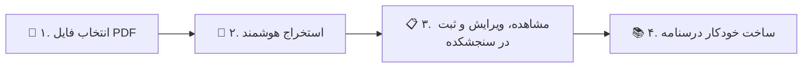

<div align="center">

# 📝 سامانه خودکار تبدیل دفترچه آزمون به سنجشکده
### PDF to Sanjeshkade: Instant AI Quiz Extractor & Auto-Uploader

[](https://streamlit.io/)
[](https://ai.google.dev/)
[](https://www.selenium.dev/)
[](https://opensource.org/licenses/MIT)

<br/>

**دیگه نیازی به ساعت‌ها کپی‌پیست دستی، تایپ فرمول‌ها و تیک زدن گزینه‌ها در سنجشکده ندارید!**  
این برنامه کل دفترچه آزمون رو می‌خونه، پاسخنامه سازمان سنجش رو روش منطبق می‌کنه و با یک کلیک همه رو می‌فرسته تو پنل کاربریتون.

<br/>

[**🇮🇷 راهنمای فارسی و نحوه استفاده**](#-راهنمای-فارسی) &nbsp; | &nbsp; [**🇬🇧 English Summary & Usage**](#-english-guide)

</div>

---

<a name="-راهنمای-فارسی"></a>
## 🇮🇷 راهنمای فارسی

### 🎯 این برنامه چه کاری براتون انجام میده؟ (نتیجه نهایی)
1. **استخراج ۱۰۰٪ خودکار سوالات از PDF:** دفترچه آزمون (کنکور، ارشد، دکتری یا استخدامی) رو به برنامه می‌دید؛ هوش مصنوعی تمام سوالات، ۴ گزینه، متن‌های طولانی (ریدینگ‌ها)، جدول‌ها و فرمول‌های LaTeX رو دقیق استخراج می‌کنه.
2. **انطباق خودکار کلید پاسخنامه:** صفحه کلید آزمون رو می‌خونه و گزینه صحیح هر سوال رو خودش مشخص می‌کنه.
3. **ثبت خودکار در سایت سنجشکده ([sanjeshkade.ir](https://sanjeshkade.ir)):** مرورگر رو باز می‌کنه، وارد اکانتتون میشه و تمام سوالات رو به همراه تگ و سال آزمون، دونه‌دونه وارد و تایید می‌کنه.
4. **ساخت خودکار و دسته‌جمعی درسنامه‌ها:** به صورت نامرئی وارد سنجشکده شده، شناسه‌های تمام سوالات ثبت‌شده در درس رو استخراج می‌کنه و با یک کلیک فرآیند هوش مصنوعی ساخت درسنامه (Lesson Plan) رو برای تک‌تک اون‌ها فعال می‌کنه.

---

### 🚀 نحوه اجرای سریع و آسان (بدون نیاز به دانش فنی)

#### 🪟 برای کاربران ویندوز (Windows)
فقط کافیه روی فایل زیر **دوبار کلیک (Double-Click)** کنید:
📁 **`run_windows.bat`**
> 💡 اگر پایتون نصب نباشه یا پکیج‌ها ناقص باشن، برنامه به صورت خودکار همه چیز رو آماده می‌کنه و در مرورگر باز میشه.

#### 🐧 🍏 برای کاربران لینوکس و مک (Linux / macOS)
یک ترمینال در پوشه پروژه باز کنید و دستور زیر رو بزنید:
```bash
bash run_linux_mac.sh
```

---

### 📋 ۴ مرحله ساده برای کار با سامانه



1. **مرحله ۱ (تنظیمات اولیه در سایدبار راست):**
   * **کلید API گوگل:** کلید رایگان خودتون رو از [Google AI Studio](https://aistudio.google.com/app/apikey) بگیرید و وارد کنید.
   * **اطلاعات سنجشکده:** نام کاربری، رمز عبور، لینک صفحه ثبت سوال درس (مثلاً `https://sanjeshkade.ir/User/Lessons/CreateQuestion/300`) و عنوان آزمون/تگ رو بنویسید.
   *(این اطلاعات روی سیستم خودتون ذخیره میشن و دفعه‌های بعد نیاز به تایپ مجدد نیست).*

2. **مرحله ۲ (استخراج هوشمند سوالات و کلید):**
   * فایل PDF دفترچه رو انتخاب کنید.
   * مدل مورد نظر هوش مصنوعی (مثل **Gemini 2.5 Flash** یا **Gemini 3.6 Flash**) رو انتخاب کنید.
   * وضعیت پاسخنامه رو مشخص کرده و دکمه **شروع استخراج** رو بزنید.

3. **مرحله ۳ (مشاهده، ویرایش و ثبت نهایی در سنجشکده):**
   * در تب دوم سوالات رو در جدول هوشمند بازبینی کنید، اصلاحات دلخواه رو اعمال کنید یا خروجی JSON بگیرید.
   * در تب سوم دکمه **شروع فرآیند بارگذاری خودکار** رو بزنید تا ربات همه سوالات رو در سایت ثبت کنه.

4. **مرحله ۴ (تولید خودکار درسنامه‌ها):**
   * در تب چهارم، آدرس یا شناسه درس (مثلاً `300`) رو وارد کرده و دکمه **شروع ورود و ساخت خودکار درسنامه‌ها** رو بزنید.
   * برنامه بدون دخالت دست، کوکی نشست رو برداشته و فرآیند تولید درسنامه تمام سوالات درس رو با گزارش لحظه‌ای استارت می‌زنه!

---

### 💻 استفاده از اسکریپت ترمینال درسنامه (`sanjesh.py`)
برای کاربرانی که ترجیح می‌دن مستقیم از خط فرمان برای درسنامه‌ها استفاده کنن:

```bash
# لاگین خودکار نامرئی و تولید درسنامه برای درس شماره ۳۰۰
python sanjesh.py --referer 300 --username "you@gmail.com" --password "your_pass"

# یا اجرا با کوکی اختصاصی مرورگر
python sanjesh.py --referer "https://sanjeshkade.ir/User/Lessons/Questions/300" --cookie ".AspNetCore.Cookies=..."
```

---

### 📦 راهنمای نصب دستی (برای برنامه‌نویسان)

```bash
# ۱. ساخت و فعال‌سازی محیط مجازی
python3 -m venv .venv
source .venv/bin/activate   # در ویندوز: .venv\Scripts\activate

# ۲. نصب نیازمندی‌ها
pip install -r requirements.txt

# ۳. اجرای داشبورد
streamlit run app.py
```

---

<br/>

<a name="-english-guide"></a>
## 🇬🇧 English Guide

### 🎯 What Does This Project Do? (Core Outcome)
* **Automated Exam Extraction:** Feed any multiple-choice quiz PDF (university entrance, professional certifications, etc.) to the app. Google Gemini Vision AI parses all questions, 4 options, long reading passages, and formulas.
* **Smart Answer Key Matching:** Automatically reads the official answer key table and sets the correct option for every single question.
* **One-Click Sanjeshkade Upload:** Automatically logs into [sanjeshkade.ir](https://sanjeshkade.ir) via Selenium and registers all questions with tags and session years.
* **Batch Lesson Plan Generation:** Discovers all questions inside any lesson on Sanjeshkade and triggers the AI lesson plan generation (`GenerateLessonPlanBatch`) in batch with live progress tracking.

---

### 📁 Project Structure

| File / Directory | Description |
| :--- | :--- |
| **`app.py`** | Modern interactive Web Dashboard with 4 tabs (Streamlit). |
| **`core_extractor.py`** | AI Vision engine with zero-thinking-latency optimization for Gemini 2.5 / 3.x. |
| **`core_automator.py`** | Selenium automation engine for multi-browser self-healing login and question registration. |
| **`sanjesh.py`** | Headless cookie extractor & batch lesson plan generator (CLI + API). |
| **`run_windows.bat`** | One-click launcher for Windows. |
| **`run_linux_mac.sh`** | One-click launcher for Linux and macOS. |
| **`requirements.txt`** | List of required Python packages. |

---

### ⭐ حمایت از پروژه
اگر این ابزار ساعت‌ها کار تکراری رو براتون حذف کرد، با زدن دکمه **⭐️ Star** در بالای صفحه گیت‌هاب خستگی رو از تنمون در کنید! 😉🚀

